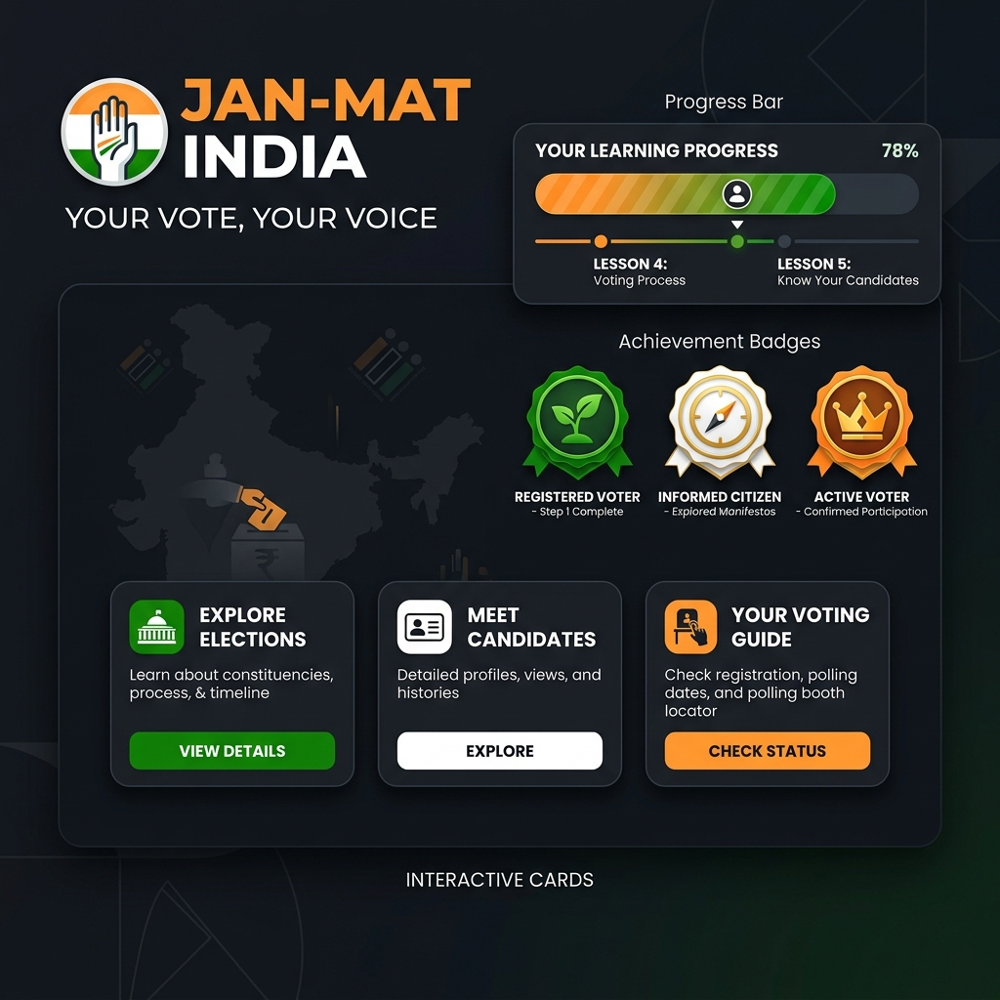
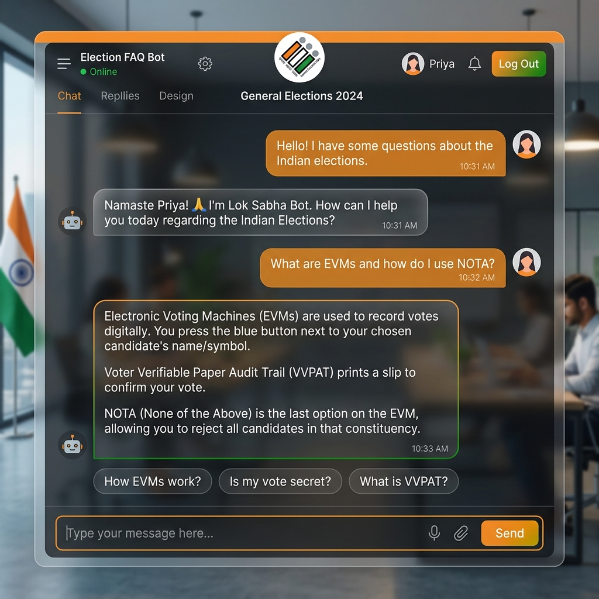

# 🇮🇳 Jan-Mat India | Election Guide AI

> An interactive AI-powered platform that simplifies the Indian election process through guided learning, real-life scenarios, gamification, and a smart FAQ chatbot.

🔗 **Live Demo:** https://soumyadeep99.github.io/Election-Guide-AI/
📂 **Repository:** https://github.com/Soumyadeep99/Election-Guide-AI

---

## 🚀 Key Features

* 📊 **Progress Tracking & Achievements**
* 🎭 **Real-Life Scenario Simulator**
* 🧠 **Smart FAQ Chatbot (AI-based)**
* 📝 **Interactive Quiz System (with feedback)**
* 👤 **Role-Based Guidance (Voter/Candidate)**
* 🎴 **Animated Flashcards for learning**

---

## 🧠 How It Works (Quick View)

```text
User → Select Feature → AI Prompt → Structured Response → Visual UI
```

* Built using **Google Antigravity AI**
* Uses **prompt engineering instead of heavy ML models**
* Focuses on **clarity, usability, and interaction**

---

## 🎮 Gamified Learning Experience

* Tracks user progress across sections
* Unlocks achievements dynamically
* Motivates users to complete all modules

🏆 Example Badges:

* 🌱 Getting Started
* 🧭 Explorer
* 🏅 Election Learner
* 👑 Quiz Master

---

## 🎭 Scenario Simulator

Real-world election situations explained clearly:

* What if I don’t vote?
* What if EVM fails?
* What if my name is not in voter list?

👉 Each scenario provides:

* Explanation
* Step-by-step outcome
* What you should do

---

## 🧠 Smart FAQ Chatbot

* Answers election-related questions
* Uses smart filtering (rejects unrelated queries)
* Provides structured bullet-point responses

✔ Example:

* What is EVM?
* What is NOTA?
* How are votes counted?

---

## 📝 Quiz System

* Multiple-choice questions
* Score calculation
* Feedback + improvement suggestions

👉 Example Output:

```text
Your Score: 4/5  
Feedback: Great! You have strong understanding of elections.
```

---

## 🎨 UI & Experience

* Modern **glassmorphism design**
* Smooth animations & transitions
* Mobile responsive layout
* Clean and intuitive navigation

---

## 🛠️ Tech Stack

* HTML5
* CSS3 (Glassmorphism + Animations)
* JavaScript (ES6)
* Google Antigravity AI

---

## 📁 Project Structure

```text
Election-Guide-AI/
├── index.html
├── style.css
├── script.js
├── assets/
└── README.md
```

---

## 📸 Screenshots

### 🏠 Home Dashboard



### 🧠 FAQ Chatbot



---

## 📌 Problem

Many citizens, especially first-time voters, lack clear understanding of the election process in India.

---

## 💡 Solution

Jan-Mat India provides a **simple, interactive, and engaging learning platform** to make election knowledge accessible to everyone.

---

## 🔮 Future Scope

* 🌐 Multi-language support
* 🏆 Leaderboards & competition
* 🎤 Voice interaction
* 📜 Certification system

---

## 👨‍💻 Author

**Soumyadeep Jana**

---

## ❤️ Built With

Built using **Google Antigravity AI** with prompt engineering and interactive UI design.

---

⭐ If you like this project, consider giving it a star!
